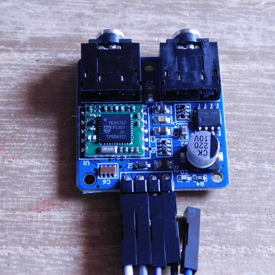
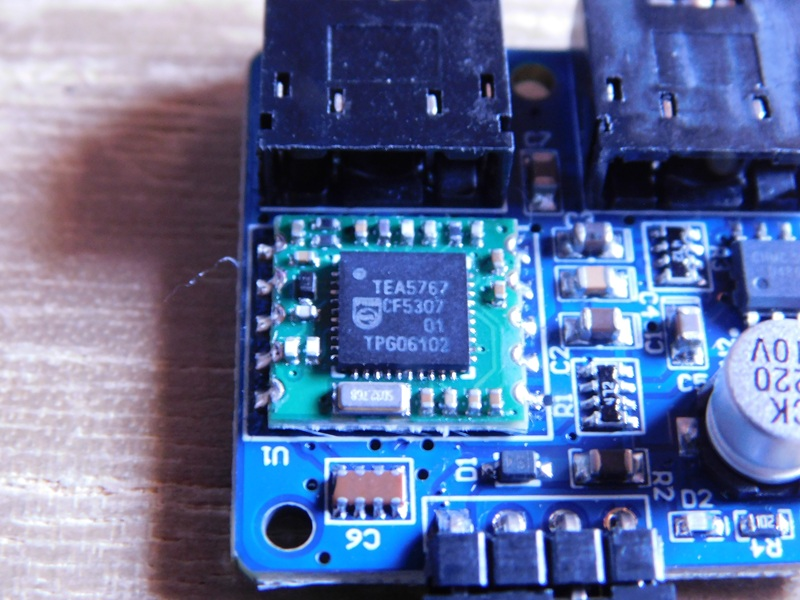

# Tinygo-Radio
このリポジトリでは、I2Cで制御できるDSPラジオモジュールをTinygoでコントロールするためのパッケージを公開しています。  

## [TEA5767](./tea5767/README.md) 用パッケージ
NXP Semiconductors（旧Philips）製のFMラジオ受信DSPモジュールで、低消費電力、I²C制御、自動同調(AFC)、ステレオ復調を備えている。  
外付け部品が少なく、組み込み機器や携帯端末への実装が容易で、安定した受信性能を手軽に利用できる。  

詳細は、以下のディレクトリをご覧ください。  
[./tea5767/README.md](./tea5767/README.md)

----

## RDA5807 用パッケージ
RDA Microelectronics製のFMラジオ受信DSPモジュールで、低消費電力、I²C制御、自動同調(AFC)、ステレオ復調を備えている。  
外付け部品が少なく、組み込み機器への搭載が容易である。さらに内蔵アンテナ入力の柔軟性や高感度受信が評価され、携帯端末やDIYラジオで広く利用されている。  

調査/研究中

----

## Si4703 用パッケージ
Silicon Labs製のFMラジオ受信DSPモジュールで、高感度受信、低消費電力、I²C制御、ステレオ復調を備えている。  
外付け部品が少なく、組み込み用途に適した設計である。さらにRDS（Radio Data System）対応が特徴で、局名やテキスト情報の取得が可能なため、情報表示機器や高機能ラジオ製品で広く利用されている。  

調査/研究中

----

