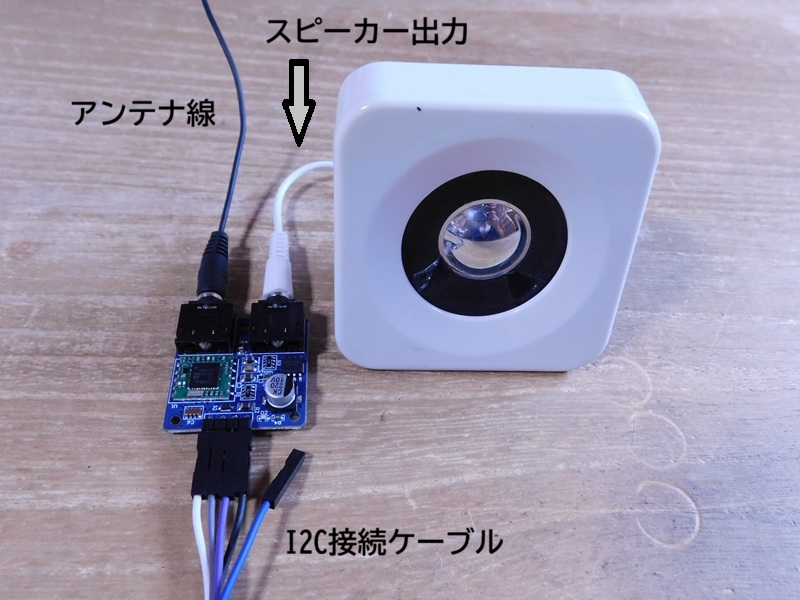
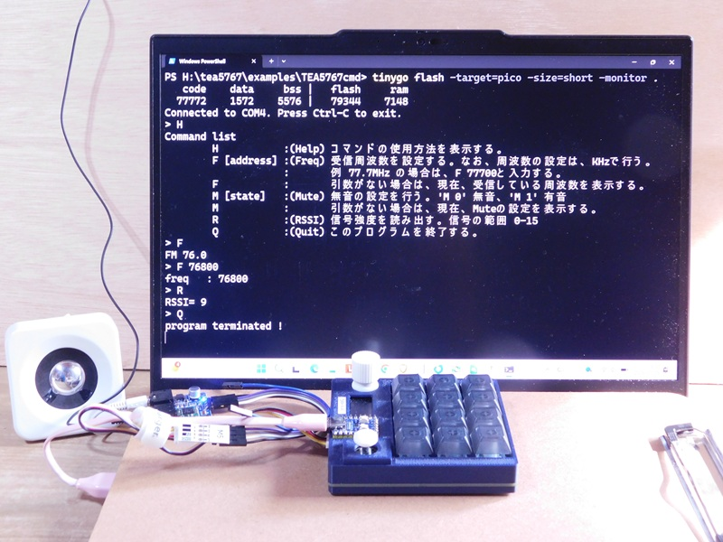

# TEA5767

FMラジオ受信DSPモジュールTEA5767をTinygoでコントロールするためのパッケージです。



## TEA5767の特徴

TEA5767は、NXP Semiconductors（旧Philips）製のFMラジオ受信DSPモジュールで、低消費電力、I²C制御、自動同調(AFC)、ステレオ復調を備えている。  
外付け部品が少なく、組み込み機器や携帯端末への実装が容易で、安定した受信性能を手軽に利用できる。  

## 使用方法

以下のコマンドで、このリポジトリの内容をローカルにコピーして下さい。

```bash
git clone https://github.com/triring/Tinygo-Radio.git
```

コピーされたTinygo-Radio/tea5767ディレクトリ内のファイル構成
```bash
|   go.mod
|   go.sum
|   README.md
|   tea5767.go
|
\---examples
    +---FreqScan    全周波数帯の信号強度を取得
    |       main.go
    |
    +---GetRSSI     信号強度を取得
    |       main.go
    |
    +---MuteTest    無音(ミュート)と有音の切替え
    |       main.go
    |
    +---Simple      もっとも単純な受信テストです。main.goで、受信したい周波数を編集してから、コンパイル&転送して下さい。
    |       main.go
    |
    \---TEA5767cmd  コマンドにより、TEA5767を制御する。最初にHを入力し、ヘルプを表示してみて下さい。
            main.go
```

### ハードウェアの準備

1. 使用するターゲットボードとTEA5767ラジオモジュールをI2Cケーブルで接続して下さい。
2. PCとターゲットボードをUSBケーブルで接続して下さい。



### サンプルの実行

コピーしたディレクトリ内に、examplesディレクトリがあります。  
この中にテスト用コードがあります。  

1. 最初に、このREADME.mdがあるディレクトリで、1度だけ以下のコマンドを実行して下さい。

```bash
go mod init tea5767
go mod tidy
go: finding module for package tinygo.org/x/drivers
go: found tinygo.org/x/drivers in tinygo.org/x/drivers v0.35.0

go get github.com/triring/Tinygo-Radio/tea5767
```

2. 実行したいコードのあるディレクトリ内に移動して下さい。その中にあるmain.goを開き、必要に応じて、お住まいの地域で、受信できるFM放送局の周波数をfreq変数に設定して下さい。(KHzで設定して下さい。)

```bash
	freq := 77700   // KHzで設定すること
```

3. 以下のコマンドで、コンパイル&実行ファイルの転送を行って下さい。今回は、Raspberrypi picoの互換ボードを使用しているので、-targetオプションをpicoと設定しています。他のマイコンボードを使用する場合は、そのボードに合わせて修正して下さい。

```bash
tinygo flash -target=pico -size=short -monitor .
```

## 問題点

このDSPチップは、ワイドFM(90.1 - 94.9 MHz) 放送が始まる前に設計された製品である。(2002 - 2003年頃に開発・発売されたらしい。)
よって、受信周波数帯を日本エリア(76.0 - 91.0 MHz)に設定するとワイドFMは受信できない。  
そこで、ワイドFMを受信するために受信周波数帯をUS/Euroエリア(87.5  - 108.0 MHz)に切り替えて受信することになる。  
しかし、この設定を日本エリアから、US/Euroエリアに切り替えると、チップがハングアップしてしまう場合がある。  
こうなると、完全に電源を落とし、DSPモジュールを完全にリセットした状態にしないと、I2Cの通信を受け付けなくなる。    
今後の検討課題である。  
